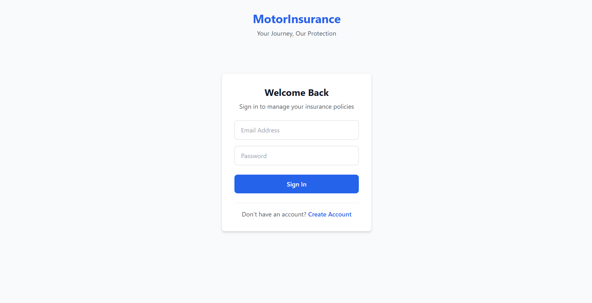
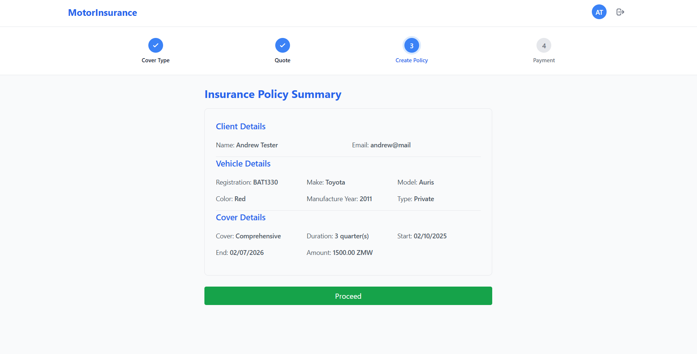
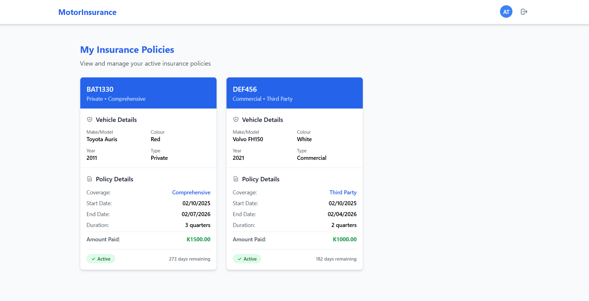
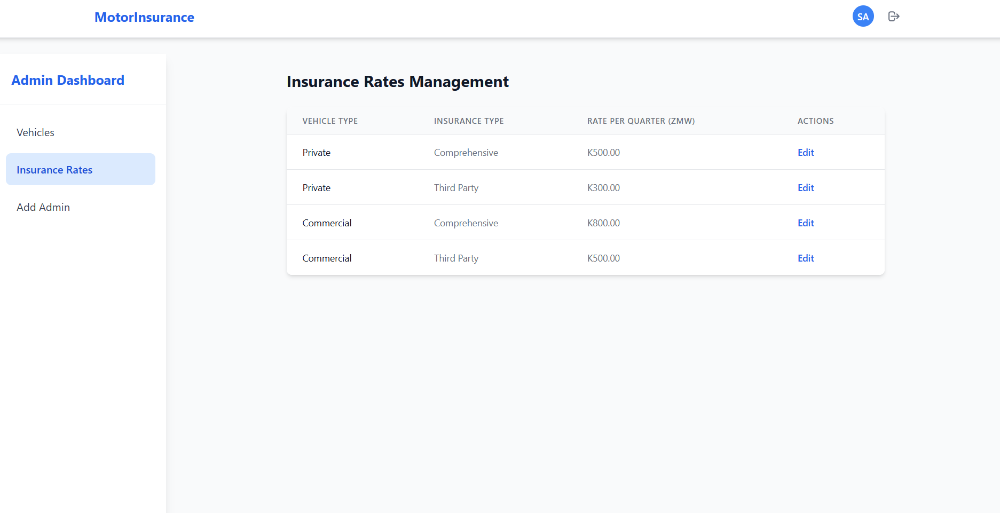

# Motor Insurance Web Application

A modern, full-stack motor insurance management system built with .NET 9, and PostgreSQL backend with a React, TypeScript frontend. Streamline vehicle insurance purchases, policy management, and administrative oversight.

## What This App Does

- **For Clients**: Search and Add vehicles, get instant insurance quotes, purchase policies, and manage active insurance
- **For Admins**: Comprehensive dashboard for vehicle management, insurance rate configuration, policy oversight, and user administration
- **Streamlined Process**: Registration → Vehicle Search → Quote → Policy Creation → Payment → Active Coverage

##  User Roles & Access

### **Client Users**
- Register & login to personal account
- Search vehicles by registration number
- Add new vehicles to the system
- Get instant insurance quotes (Comprehensive/Third Party)
- Purchase insurance policies
- View active policies dashboard
- Secure payment processing

### **Admin Users** 
- Full vehicle CRUD operations
- Manage insurance rates and pricing
- View all active policies and payments
- User management and admin creation
- System oversight and reporting

## Quick Setup (Docker - Recommended)

### **Prerequisites**
- Docker Desktop installed and running
- Git

### **One-Command Setup**
```bash
# Clone the repository
git clone https://github.com/AndrewChiziba/Motor-Insurance.git
cd Motor-Insurance

# Start the entire application
docker-compose up -d --build
```

## Access Points
 - Frontend App: http://localhost:3001
 - Backend API: http://localhost:8081
 - Database Admin (PgAdmin): http://localhost:5051
 - Database: localhost:5433

## Default Logins
 - Admin: admin@mail.com / Password1234!
 - User: Creates a new account
 - Database Admin (PgAdmin): http://localhost:5051
 - Database: localhost:5433

## pgAdmin Login (Optional)
 - Host name/address: postgres-db ( use Docker container name, NOT localhost)
 - Port: 5432 (Internal port, NOT 5433)
 - Maintenance database: MotorInsuranceDb
 - Username: postgres
 - Password: postgres
  
## Seeded Data
 - See (/motor-insurance-backend/Data/SeedData.cs)
 - Vehicles (e.g. ABC123, BBA1212)
 - Insurance Rates
 - Admin user account
 - Password: postgres


## Local Development

### **Prerequisites**
- **Backend**: .NET 9 SDK, PostgreSQL 17 Desktop installed and running
- **Frontend**: Node.js 20+, npm

### Backend Setup
```bash
# Clone the repository
cd motor-insurance-backend
dotnet restore

#update database connection string in motor-insurance-backend/appsetting.json

dotnet buid
dotnet run

```
### Frontend Setup
```bash
cd motor-insurance-frontend
npm install

#update base API URL in /motor-insurance-frontend/.env

npm run dev
```

## Environment Variables

### **Frontend(.env)**
- **Frontend**: Node.js 20+, npm

### **Backend(appsettings.json)**
- Database connection strings
- JWT secret keys
- Admin user seed cred.


## Potential Issues

### **Port Conflicts**
```bash
#check whats using ports
netstat -an | findstr :5433  # Windows
lsof -i :5433                # Mac/Linux

# Solution: Update ports in docker-compose.yml
```

### **Database Connection Issues**
- Ensure PostgreSQL is running for local developement
- Verify database credentials
- Check container status: ```bash docker ps ```

### **Docker Issues**
```bash
docker-compose down
docker-compose up -d --build
docker-compose logs [service-name]
```
### **Frontend API Calls Failing**
  Update *.env* VITE_API_URL to match your backend.Ensure PostgreSQL is running for local developement
- Docker: http://localhost:8081
- Local: http://localhost:5126
- Update CORS config in *Program.cs* to allow requests from frontend url

## Application Screenshots
### Login

### Insurance Quote

### Client Dashboard

### Admin Dashboard


## Contributions
Feel free to fork, create feature branches and create Pull Requests